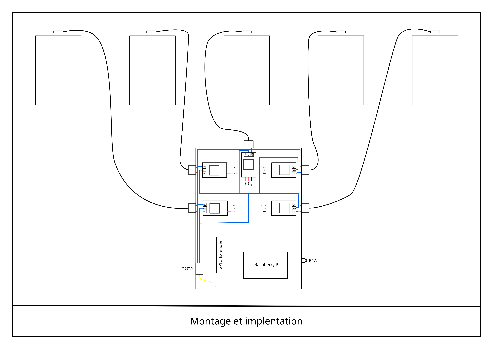
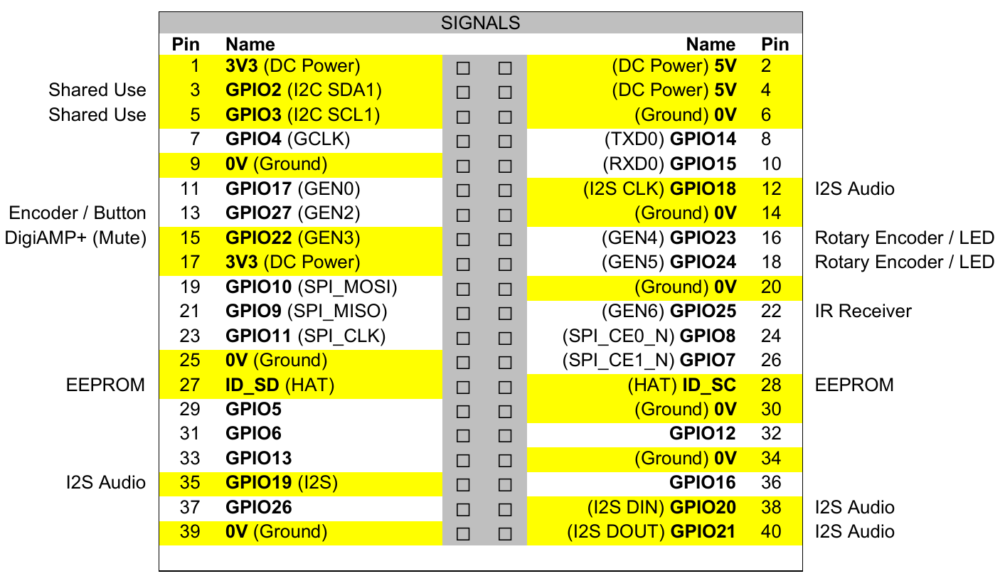

# blueNote

## Turn ON

Plug the power supply and switch from position `0` to position `1`. The relay GPIO.14 turn on few seconds and turn off again. 

45 to 60 seconds later, the routine script trigger the first lap.

Wire the fans as show in the picture.


## Code

### routine.sh

`routine.sh` is active at the boot sequence. 
```
crontab -e
```
`@reboot` option

you can change the range of the trigger simply by changing the two variables `l.9` and `l.10` :

```
mindel=540
maxdel=660
```

### python scripts

Each `.wav` file as a `.txt` score and `.py` script. The score was extracted from the midi files (`midi` folder). Due to the silence in the start of each track, i put a `sleep()` (`l.52`) to resynchronise a bit better with the sound.

Basicly, after analysis of each track, there is a list of note. eache fans will be trigger by certain note of this list. The number depend of the track and the length of the list.

We can easily change with `rangeof[]` list of in `findGoodFan()` function.

After parsing the `.txt` score, we look for : 

- the last char of `note_on/note_off`to trigger ON or OFF
- the pitch of `note=xx`
- the duration call `time=xxxx`

There is a little offset we can adjust in `###TRIGGER NOTES` part to avoid the note when the duration is below n millis `l.67`

## Schematic



We use `RaleyPin=[14, 16, 8, 7, 12]`\
Le diagramme renseigne l'emplacement physique des relais.

Certains GPIO sont occupés par le DAC+ (`iqaudio.pdf`)
